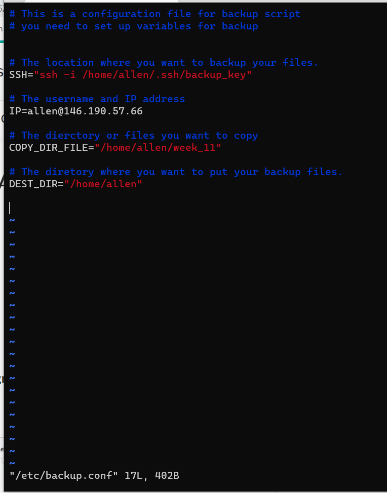
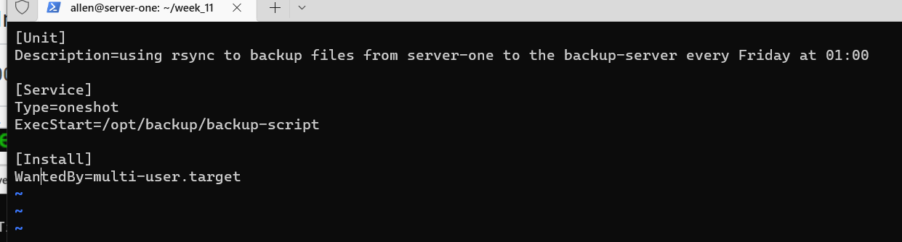
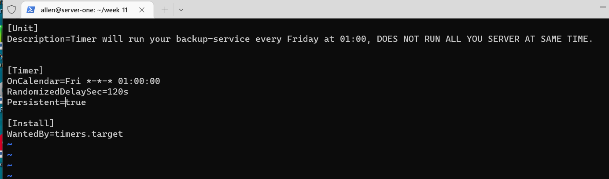

ACIT 2420 Linux Week 11 Lab
===============

Completed by Hened Medina and Hao Li


This README.MD guides how to do the following:
----------------------------------------------
1. Backup Directories from one server to a backup-server at 1am on Friday.
2. Viewing Weather Forecast from a specific specity at 5am everyday.

**Note:** Each instructions has its own script, service file, and timer file found in the repo


Resources/Technologies Used
-------------------------------

- WSL - Windows Subsystem for Linux (Ubuntu)
- DigitalOcean Droplets
- Windows Terminal (with Administrative Privileges)


Prerequisites and Assumptions (DigitalOcean and WSL setup)
----------------------------------
**Note:** The following video is assumed to be watched. The video includes specific commands when setting up DigitalOcean Droplets. The setup instructions below are to be done once the user has watched the video.

Follow along the embedded video to setup [DigitalOcean Droplets](https://vimeo.com/758870226/f75da348fc?embedded=true&source=video_title&owner=17609105)

**Note:** 
Ensure to name the two droplets: **server-one** and **backup-server**. These will be the hostnames for your servers. These servers must have root privileges

WSL Setup
-------------------------

1. Install WSL on the  host machine with the following command: `wsl --install -d Ubuntu`
2. As root in **WSL**,  create a regular user with the following command: `useradd -ms /bin/bash`
3. Login as the newly created regular user


## 1. Installation

Clone the Repository in your Linux Machine using:

```
git clone https://github.com/username/2420_week11_Lab.git
```

## Creating the Configuration file
1. Create a new file called backup_script.conf in the /etc directory. Use:
```
sudo vim back /etc/backup-script.conf
```
2. Follow the content in the screenshot below for the configuration file



3. Save and exit your backup_script.conf file

## Creating the Service File
1. Use the Command to create a new service file:
```
vim backup-script.service
```
2. Follow the content in the screenshot below for the service file



**Note:** The Description describes what the script will do

## Creating the Timer File
1. Use the Command to create a new timer file:
```
vim backup-script.timer
```
2. Follow the content in the screenshot below for the timer file

